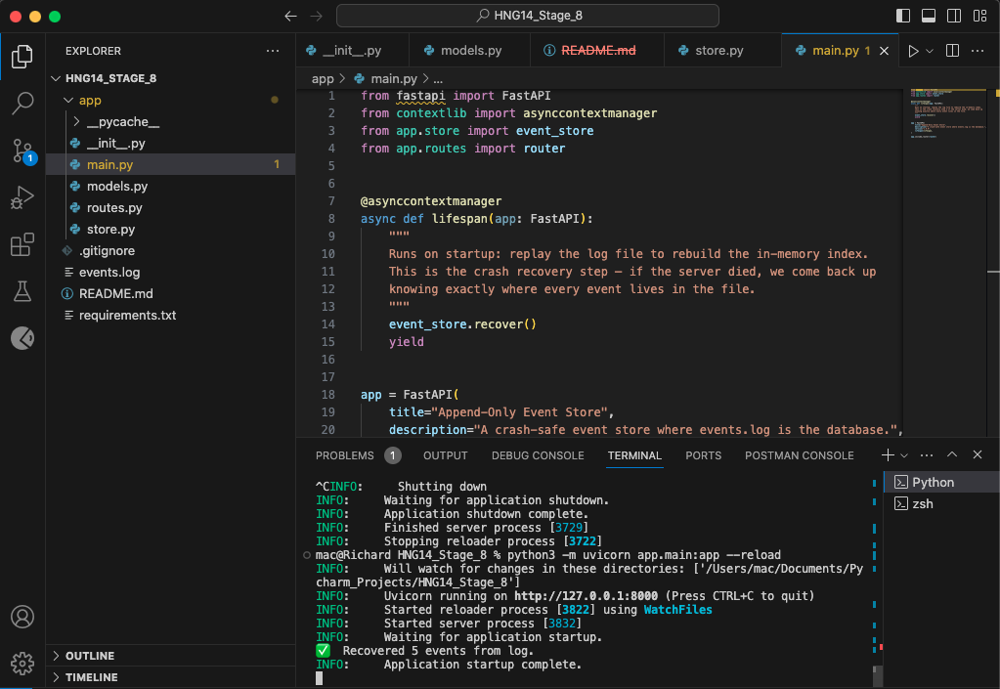

# Append-Only Event Store

A crash-safe event store built with FastAPI where `events.log` is the database.
Built as part of the Dilamme R&D Infrastructure & Resilience challenge (Stage 8a).

---

## What This Project Does

This is a small HTTP service that stores events in an append-only log file and reads
them back by ID, even after a server restart. There is no SQLite, no MongoDB, no JSON
file being rewritten — the log file itself is the database.

---

## Setup

### Requirements
- Python 3.12+

### Install and Run

```bash
# 1. Clone the repo
git clone https://github.com/Richardeze/Append-Only-Event-Store.git
cd Append-Only-Event-Store

# 2. Create a virtual environment
python3 -m venv venv
source venv/bin/activate

# 3. Install dependencies
pip install -r requirements.txt

# 4. Start the server
python3 -m uvicorn app.main:app --reload
```

Server runs at `http://localhost:8000`
Interactive API docs at `http://localhost:8000/docs`

---

## API Endpoints

### POST /events — Write a new event
```bash
curl -X POST http://localhost:8000/events \
  -H "Content-Type: application/json" \
  -d '{"type": "order.placed", "payload": {"user_id": 1}}'
```

Response (201):
```json
{
  "id": "da752f90-f0b6-496c-8849-683c4364a17d",
  "type": "order.placed",
  "payload": { "user_id": 1 },
  "createdAt": "2026-05-31T01:36:15.419382+00:00"
}
```

### GET /events/:id — Read one event by ID
```bash
curl http://localhost:8000/events/da752f90-f0b6-496c-8849-683c4364a17d
```

Returns the event or 404 if the ID does not exist.

### GET /events — List all events
```bash
curl http://localhost:8000/events
```

### GET /stats — Store statistics
```bash
curl http://localhost:8000/stats
```

Response:
```json
{ "total": 5, "bytes": 693 }
```

---

## Architecture

### The Log + In-Memory Index
```
┌─────────────────────────────────────────────────────────┐
│                     IN-MEMORY INDEX (RAM)                │
│                                                          │
│  {                                                       │
│    "da752f90-...": { offset: 0,   length: 85  }         │
│    "81000ae2-...": { offset: 85,  length: 92  }         │
│    "835a450c-...": { offset: 177, length: 78  }         │
│  }                                                       │
└─────────────────────────────────────────────────────────┘
│
│ points to
▼
┌─────────────────────────────────────────────────────────┐
│                      events.log (DISK)                   │
│                                                          │
│  byte 0   → {"id":"da752f90","type":"order.placed",...} │
│  byte 85  → {"id":"81000ae2","type":"user.signup",...}  │
│  byte 177 → {"id":"835a450c","type":"payment.done",...} │
│                                                          │
│  ↑ append only — new lines always added at the bottom   │
└─────────────────────────────────────────────────────────┘
```

### POST /events — How a write flows
```
Client
│  sends: {"type": "order.placed", "payload": {"user_id": 1}}
▼
FastAPI (routes.py)
│  validates the request body automatically
▼
EventStore.append()
│  1. generates UUID + createdAt timestamp
│  2. converts event to a JSON line
│  3. opens events.log in append mode
│  4. records byte offset BEFORE writing
│  5. writes the line to the END of the file
│  6. saves { offset, length } in the index
▼
Client receives the full event back with status 201
```

### GET /events/:id — How a read flows
```
Client
│  sends: GET /events/da752f90-f0b6-496c-8849-683c4364a17d
▼
FastAPI (routes.py)
│  extracts the ID from the URL
▼
EventStore.get()
│  1. looks up ID in the in-memory index
│  2. if not found → returns 404 immediately (no file opened)
│  3. if found → gets { offset: 0, length: 85 }
│  4. opens events.log, seeks to byte 0
│  5. reads exactly 85 bytes
│  6. parses JSON and returns the event
▼
Client receives the event — NO full file scan, direct seek only
```
---

## Core Concepts

### Why append-only is safer than overwriting

When a normal database updates a record, it opens the file and rewrites data
in place. If the server crashes halfway through that rewrite, you are left with
a half-written, corrupted record that cannot be recovered.

An append-only log never touches existing data. Every write just adds a new line
at the end. If the server crashes mid-write, the worst case is one incomplete
line at the bottom of the file — which our recovery code safely skips. All
previous events are untouched and perfectly intact.

### Why an index makes reads fast

Without an index, finding one event means reading the entire file from the top
until you find the right line. On a large file with millions of events that is
very slow.

Our in-memory index stores exactly where every event lives in the file —
the byte offset and length. So reading any event is always two steps:
look up the position in the index, then jump directly to that byte in the file.
It does not matter if the file has 10 events or 10 million — the read speed
is the same.

---

## Recovery Log Screenshot

When the server restarts, it replays the log file once to rebuild the index:



This means all events written in the previous session are immediately
available again — no data was lost.

---

## What I Struggled With

I ran into a 404 error when trying to fetch an event by ID because I had
accidentally missed the first character (`d`) when copying the UUID on my
first test. UUIDs have to be copied exactly — every character including
the dashes matters.

---

## What I Learned

- How databases actually store and retrieve data at the file level
- Why append-only logs are the foundation of crash-safe storage — real databases
  like Postgres use the same principle internally
- How FastAPI automatically validates incoming data using Pydantic before it
  even reaches your code
- How in-memory indexes work and why they make reads fast regardless of file size
- How byte offsets and seeking work in file I/O

---

## Resources Used

- The task MD file provided with the Stage 8a brief
- Google for general Python and file I/O questions

---

## Why This Made Me a Better Backend Developer

Before this project I thought of databases as black boxes — you put data in and
get data out. Now I understand what is actually happening underneath. Data is
written to a file, a position is recorded, and reads jump directly to that
position. That mental model will change how I think about performance and
crash safety in every backend system I build from now on. I also now understand
why production databases like Postgres and Kafka are built on append-only logs —
it is not just a design choice, it is the safest and fastest way to write data
to disk.